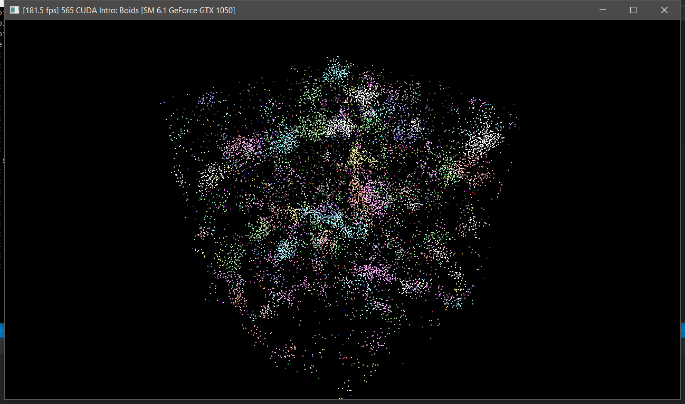
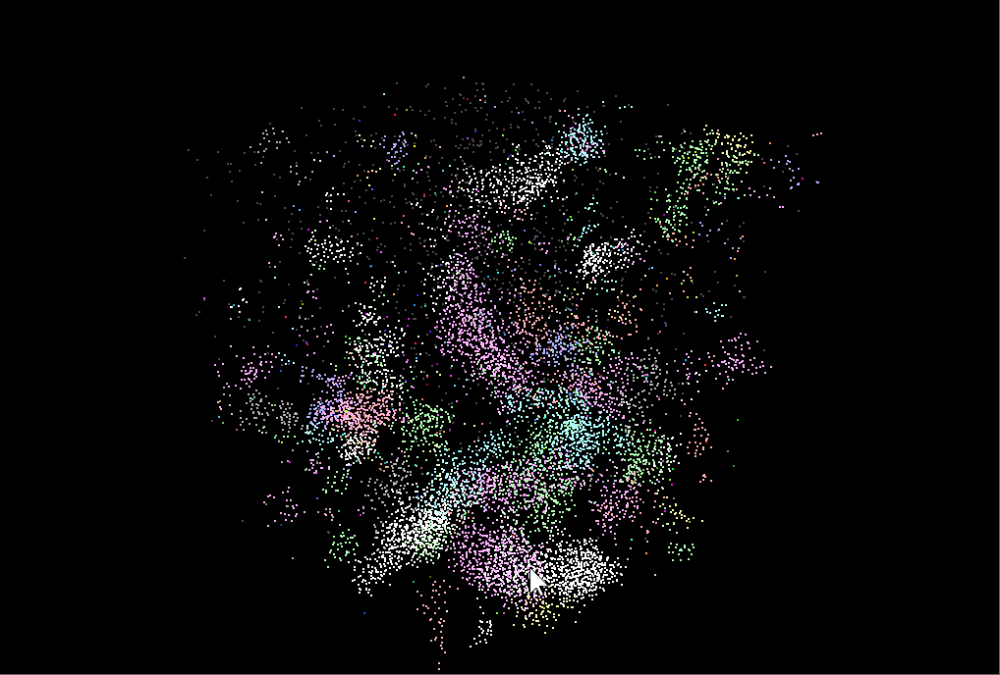
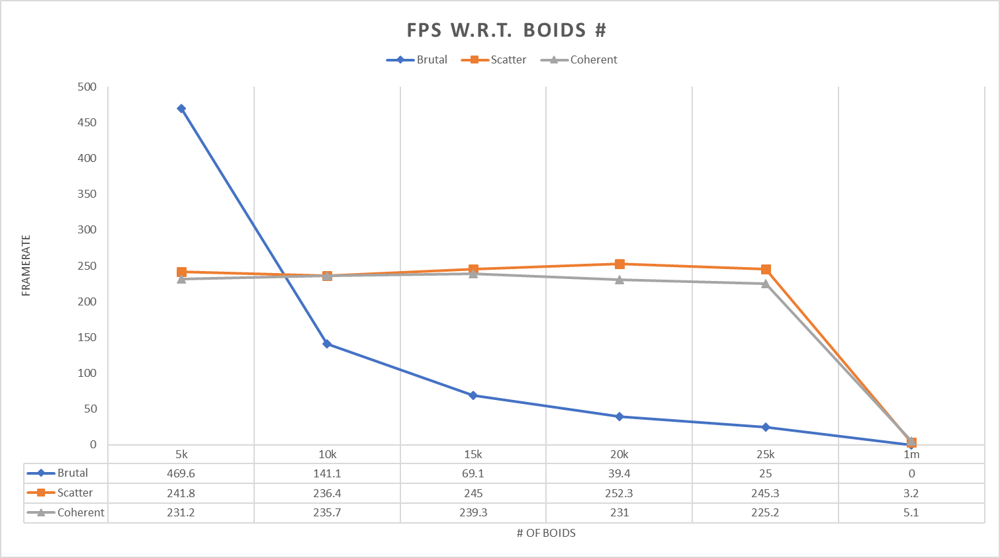
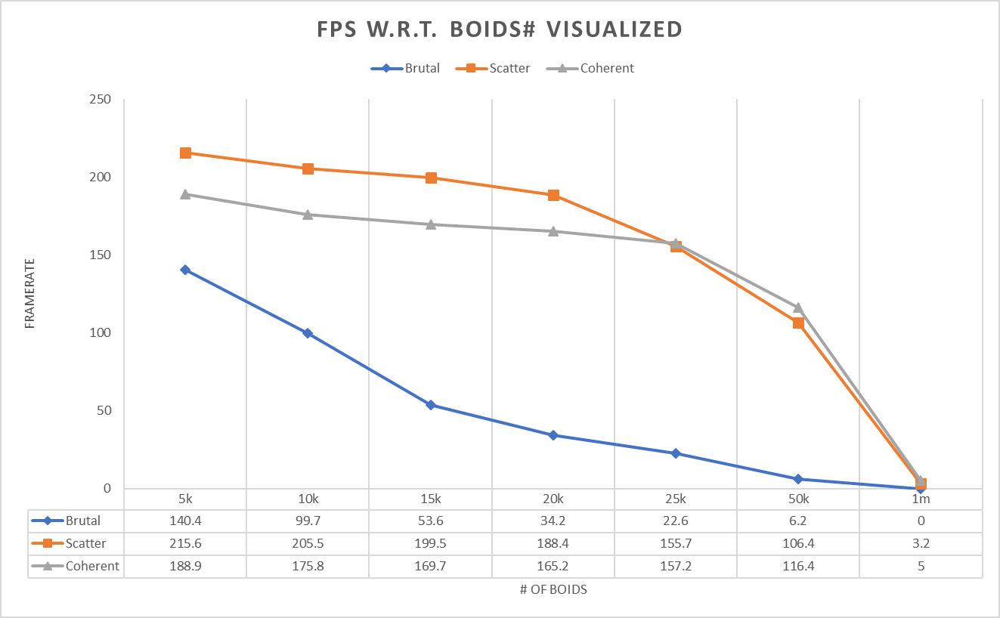
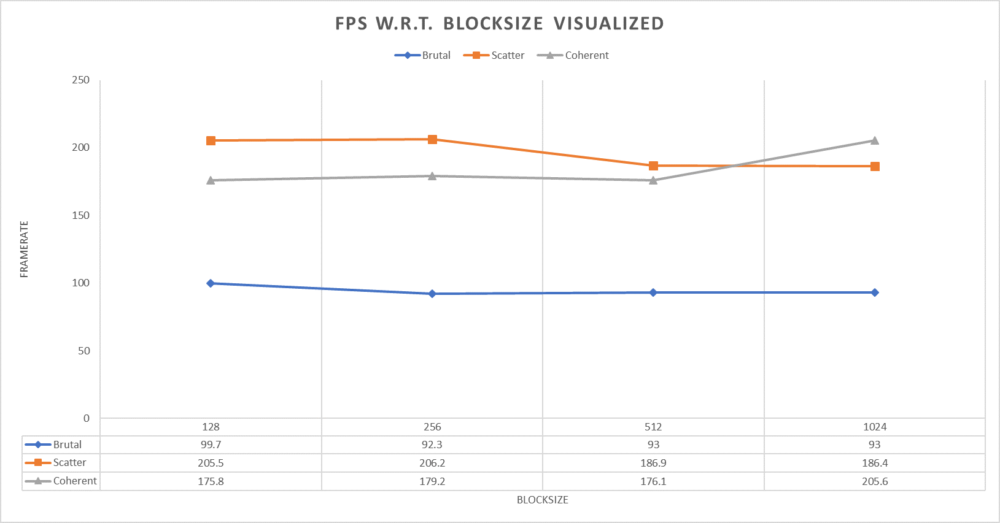

**University of Pennsylvania, CIS 565: GPU Programming and Architecture,
Project 1 - Flocking**
=======================================================================
* Jie Meng
  * [LinkedIn](https://www.linkedin.com/in/jie-meng/), [twitter](https://twitter.com/JieMeng6), etc.
* Tested on: Windows 10, i7-7700HQ @ 2.80GHz, 16GB, GTX 1050 4GB (My personal laptop)

### (Result)
* Flocking (Uniform 2xGrid Scattered @10k boids & 1024 blocksize)

* Gif

### (Performance Analysis)
**Bechmark Method:**

* Use kernel function call frequency as indicator
* Calculation method: Launch NSight Performance Analysis, use function call times(under Cuda Summary) divided by running time(substracts launching time, usually around 3s)
* In one simulation round, the kernel function is called exactly once, so this way we can get average framerate

**Data and Analysis**

Number of boids affecting framerate, NOT visualized

* For brutal method, performance is significantly affected by the number of boids: from 5k-25k boids, framerate decreases by a factor of 20. At 1 million boids, the framerate is almost 0.
* Scatter grid search method works well: its performance is relatively unsensitive (comparing to brutal force) to the change of number of boids: from 5k to 25k, framerate only has slight fluctuation around 245fps. At 1 million boids, it runs at about 3.2fps
* Coherent grid search method also has a good performance: it is also unsensitive to the change of number of boids: from 5k to 25k, framerate only has slight fluctuation around 235fps. At 1 million boids, it runs at about 5.1fps
* At 5k boids, brutal method has significantlly larger framerate than the other two, after 10k boids, it performs worse than the other two.
* Uniform Grid methods have stable performance, and essentially performs better than brutal method. This is because they only search a fixed number of cells, not all boids.
* If number of grids continues to increase, all methods would slow down
* At 1 million boids, coherent method is better(5.1fps) than scattered method(3.2fps), this suggests that coherent method performance is relatively unsensitive comparing to scattered method, and would perform better than scattered method at some number of boids(this will be clearer from next graph).

Number of boids affecting framerate, visualized

This illustrates similar results as above, differences worth pointing out:
* Even at 5k boids, uniform grid methods are better than brutal force method.
* Coherent method becomes better than scattered method after at most 50k boids.

Block size affecting framerate, visualized

From this graph:
* Brutal force method is essentially not affected by block size.
* Scattered method works worse with larger block size.
* Coherent method works better with larger block size.
* Coherent method becomes better than scattered method after a block size of 512.
* The data of uniform methods appears a strange behavior: it's not changing stably, but I think this is because the block size is increasing exponentially.

**Answer to questions:**
* Framerate decreases when the number of boids increases for all methods, since this would involve more computation.
Uniform grid methods are better than brutal force method, since much less computation is involved. With 5k boids brutal force method performs better (not visualized) because the number of boids is relatively small, so the extra operations in uniform grids methods slow them down. 
* Performance varies only slightly when block size changes(with block count changes simultaneously). I'm not sure why they changes this way(see the above graph): the brutal force method is not affected by block size; the scattered method tend to slow down when block size increases; the coherent method tend to speed up when block size increases.
I didn't figure out why it performs like this, but I guess there is something to do with memory access speed.
* I expected that the coherent method would always perform better than scattered method, but it is not. At smaller boid counts the coherent method is worse. I believe it is because
the time spent on copying arrays(reshuffle and shuffle back). But when boid count becomes significantly large, the coherent method is better, since much more boid data is sequential by shuffling, so memory access saves much more time.
* Under the configuration of (Uniform grid Scattered @ 10k boids & 1024 block size), checking 27 neighboring cells (1xgrid) is slightly faster than 8 cells: 190fps vs. 180fps, I believe this is because the boids count need to check is smaller with 1X grid size, so less data fetch operation is required, therefore performance is better.

### (Code Gists)
* In `kernel.cu` ,toggle between **GRID1X** and **GRID2X** for difference grid cell size
* Helper functions: `swapspeed` to ping-ping speed buffer, `shuffleBufferWithIndices` to shuffle position and velocity arrays.
`kernUpdateVelNeighborSearchScattered1XGRID` and  `kernUpdateVelNeighborSearchCoherent1XGRID` for 1X grid cell width search.
* 2X grid cell width search is a little bit hard code and may appears arcane.
